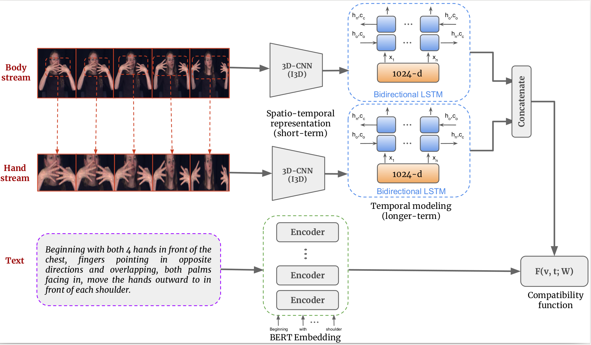

# ZSSLR
Original Pytorch implementation of [Zero-Shot Sign Language Recognition: Can Textual Data Uncover Sign Languages?](https://arxiv.org/pdf/1907.10292.pdf)
(BMVC 2019)

<p align="center">
  
</p>

If you find this helpful, please cite ZSSLR
```
@inproceedings{bilge19zsslr,
      author = {Bilge, Yunus Can and Ikizler-Cinbis, Nazli and Cinbis, Ramazan Gokberk},
      title = {Zero-Shot Sign Language Recognition: Can Textual Data Uncover Sign Languages?},
      booktitle = {Proceedings of the British Machine Vision Conference ({BMVC})},
      year = {2019}
}
```
### Requirements
The code was implemented using Python 2.7.15 and
```
torch===1.2.0
torchvision===0.4.0
scipy===1.2.2
scikit-learn===0.20.4
matplotlib===2.2.4
opencv-python===4.1.1.26
pandas===0.24.2
Pillow===6.1.0
seaborn===0.9.0
```

### Data
You can download the data from (https://drive.google.com/open?id=1drb2RYvKK2BJ3wfb6DEiXKNe2CxSo3El) and put into the relevant folders; features, pretrained_model.

### Experiments
How to evaluate the pretrained model:
```
python evaluate.py
```
How to train the model:
```
1. Modify params.json for parameters.
2. python train.py
```
Thanks!
